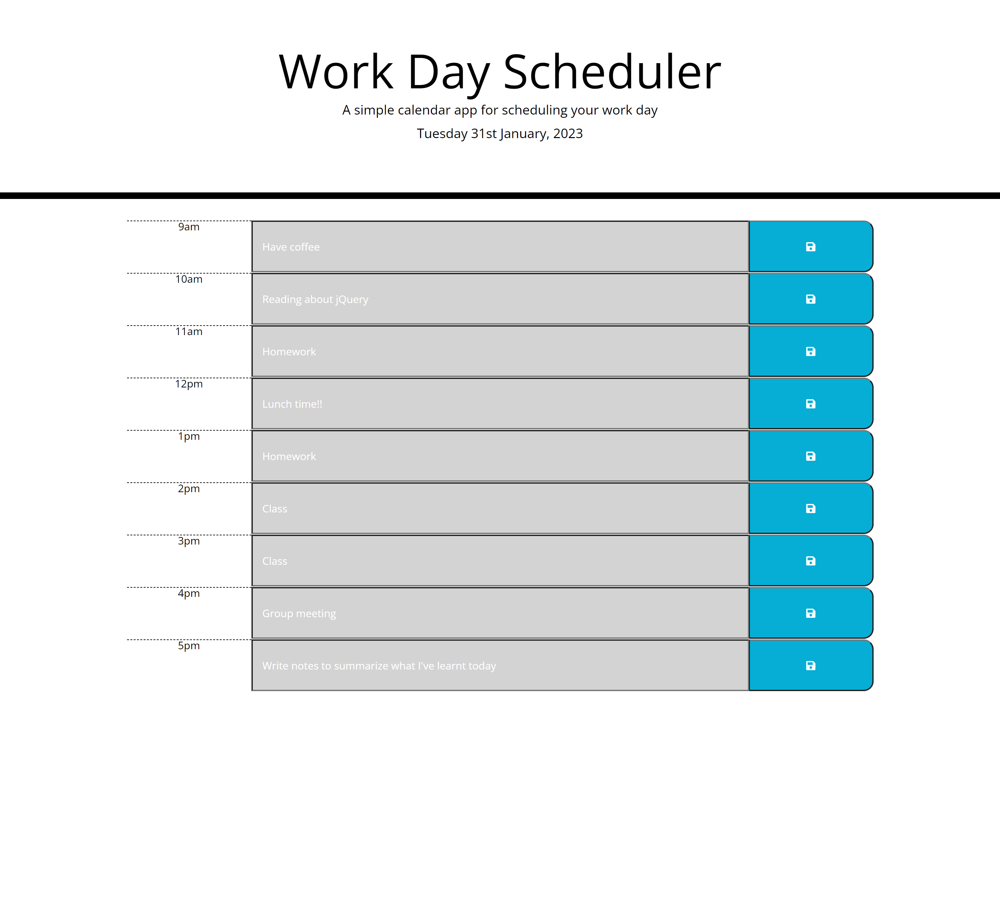

# Work Day Scheduler

A simple [Work Day Scheduler](https://amikerb.github.io/Work-Day-Scheduler/) webpage created using jQuery. Webpage shows the current date with a grid below it. The grid displays sections from 9am to 5pm, a section for the users input and save buttons for each section. 

Each section is color coded to indicate if that hour is in the past (grey), present (red) or future (green). 

Once an activity is typed into the text box and the save button is clicked the activity is saved to the local storage along with the current date. A message will also appears at the top of the screen letting the user know their activity has been saved. 

When it is a new day the activities will be cleared from the sections.

## Screenshots 

### Screenshot of webpage on desktop:

## Credit 

- [James Fisher Workday Scheduler](https://github.com/jfisher396/workday-scheduler)
- sitepoint [Managing Dates and Times Using Moment.js](https://www.sitepoint.com/managing-dates-times-using-moment-js/#:~:text=moment().,and%20a%20two%2Ddigit%20day.)
- Stack overflow [increment localStorage object name to store data from inputs](https://stackoverflow.com/questions/59642012/increment-localstorage-object-name-to-store-data-from-inputs)
- stack overflow [localStorage Array split](https://stackoverflow.com/questions/31142161/localstorage-array-split)
