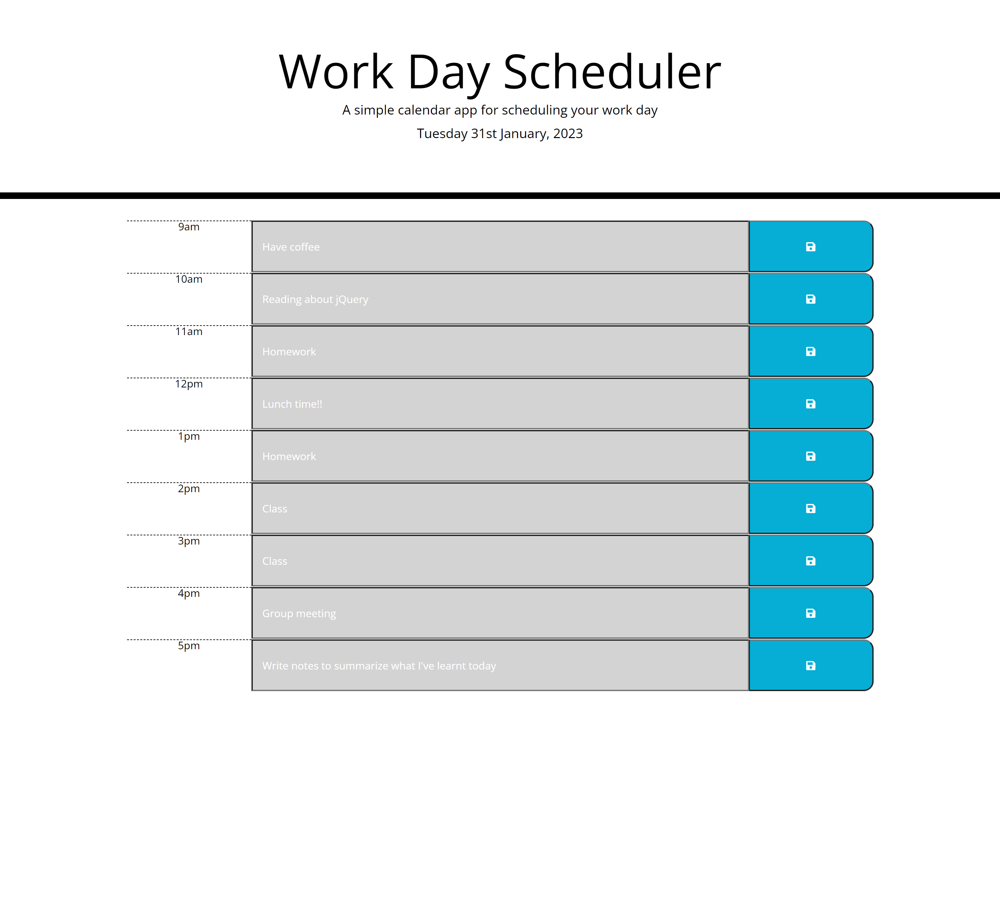

# Work Day Scheduler

A simple [webpage]() displaying a work day scheduler for the current day using jQuery. Webpage shows the current date with a table below it. The table displays a work day time from 9am to 5pm a section for the user to type in their activity for that hour and save buttons for each section. each hour section is color coded to indicate if that hour and activity are in the past (grey), present (red) or future (green). Once an activity is typd into the text box and the save button is clicked the activity is saved to the local storage with the current date also saved within the local storage. A message also appears at the top of the screen letting the user now their activity has been saved. When it is a new day the activities will be cleared from the sections as the date they were saved does not match the current date.

## Screenshots 

### Screenshot of webpage on desktop:

## Credit 

- [James Fisher Workday Scheduler](https://github.com/jfisher396/workday-scheduler)
- sitepoint [Managing Dates and Times Using Moment.js](https://www.sitepoint.com/managing-dates-times-using-moment-js/#:~:text=moment().,and%20a%20two%2Ddigit%20day.)
- Stack overflow [increment localStorage object name to store data from inputs](https://stackoverflow.com/questions/59642012/increment-localstorage-object-name-to-store-data-from-inputs)
- stack overflow [localStorage Array split](https://stackoverflow.com/questions/31142161/localstorage-array-split)
